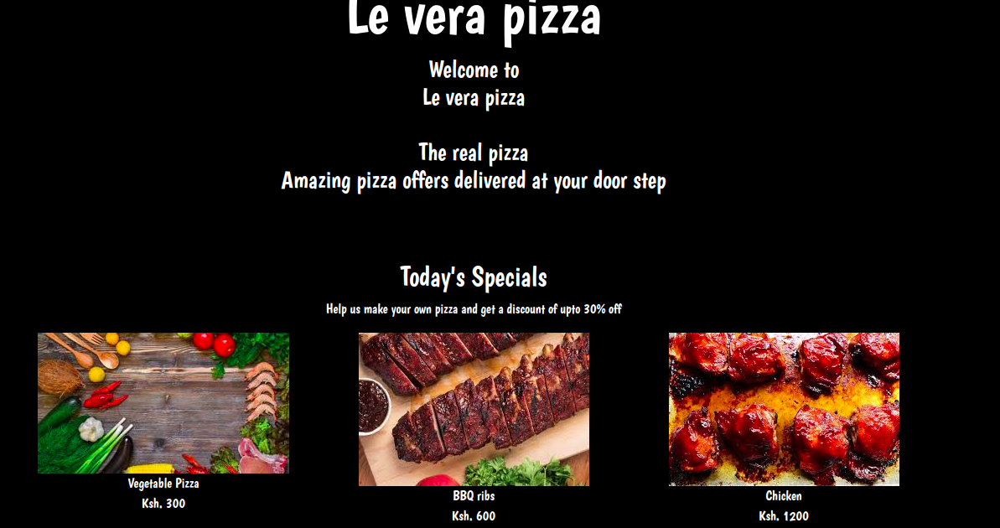

# le vera pizza
#### An application that helps user select their pizza preferances and have it delivered at their door step, 2.0
#### By **[Nyakinyua](https://www.https://github.com/Nyakinyua)**
## Description
This is a web application that allows a user to place an order depending on the pizza size they'd like, the crust and also the kind of toppings they want o their pizza. It also allows useer to select the number of pizzas they'd like. Finally, the user gets to choose whether they'd want their pizza delivered or not, if they want it delivered, they are required to enter their location and add a little delivery fee.
Go ahead and try! Have your Pizza delivered in less than 30 minutes!
## screenshot

## Setup/Installation Requirements
There are no set up or installation reqiurements
## Known Bugs
The application is not able to take orders of more than 5 pizzas at a go.
## Technologies Used
- Javascript. *JQuery
- HTML.
- Bootstrap.
- Markdown.

## BDD
| Behaviour      | Input        | Output       |
| :------------- | :----------: | -----------: |
|  Enter your name  |   Nyakinyua wanjiru |     |
| Enter your Email Address  | wanyakinyua968@gmail.com |   |
| Enter your pizza size,crust type and toppings   |  small, thin crust BBQ Chicken and Pepper    |  summary of order made   ||
|Delivery option| yes|your order will be delivered at Yaya center 
| Press Submit|     | 
## Support and contact details
Contribution and improvements to the application are welcome. Feel free to reach out to wanyakinyua968@gmail.com
### License
*This work is licensed by CC Share Alike.
 *Copyright (c) 2019*

 